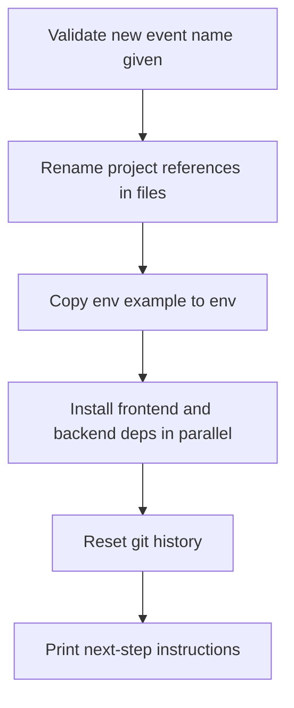
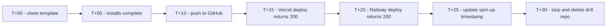

# Lecture 2 — The Template Repo Pattern

> **Duration:** ~1 hour of reading.
> **Outcome:** You can describe every file that belongs in a `hackathon-template` repo and why. You can write `./bootstrap.sh <new-event-name>` to clone, rename, and configure a new event repo in one command. You can version the template across events so each event leaves the next one better.

If you only remember two sentences from this lecture, remember these:

> **A `hackathon-template` is a *living* artifact, not a one-time setup.** You pay setup cost once, on a calm day, and never again at hour two of an event.
>
> **One command must take you from "I just heard the prompt" to "I have a renamed, configured, deploy-ready repo."** If it takes more, you have not finished the template.

Lecture 1 made the case for the boring stack. Lecture 2 makes the stack concrete. The whole investment of Week 2 is this: a personal `hackathon-template` repo on your GitHub, plus a bootstrap script that spins up an event repo from it in seconds.

---

## 1. Why a template repo and not "I'll just remember"

The dominant alternative to a template repo is "I'll just run `npm create vite@latest` at the event and add what I need." This loses for three reasons.

1. **`npm create vite@latest` gives you a *raw* Vite app.** No Tailwind. No shadcn/ui. No react-query. No FastAPI sibling. No deploy config. Every one of those takes 15–45 minutes to add cleanly. Five times 30 minutes is two and a half hours of yak-shaving while your team waits.
2. **You forget your own preferences under pressure.** "Did I want Tailwind v3 or v4? Did I use the `cn` helper or `clsx` directly?" You should not be answering these questions at hour 1.
3. **You cannot fix bugs in setup at the event.** If your CI fails at hour 30, you cannot tweak GitHub Actions and re-push three times to debug. You should know the CI works, because you proved it works on the template last month.

> **C4 voice:** the template is your sprint-board sticky note from your past self. It says "I already figured this out. Skip ahead."

---

## 2. What lives in the template repo

The complete file tree, top level. Memorize the shape.

```
hackathon-template/
├── .github/
│   └── workflows/
│       └── ci.yml                  ← minimal lint + typecheck on push
├── .gitignore                       ← excludes node_modules, .venv, .env, dist
├── .env.example                     ← every env var named with a placeholder
├── .nvmrc                           ← pins Node major version
├── .python-version                  ← pins Python major version
├── README.md                        ← the template README (Section 3)
├── bootstrap.sh                     ← the one-command spin-up (Section 5)
├── LICENSE                          ← MIT or your preference
├── frontend/
│   ├── package.json                 ← React + Vite + Tailwind + shadcn/ui + react-query
│   ├── pnpm-lock.yaml
│   ├── vite.config.ts
│   ├── tailwind.config.ts
│   ├── tsconfig.json
│   ├── index.html
│   ├── src/
│   │   ├── main.tsx                 ← React entry + QueryClient + Tailwind import
│   │   ├── App.tsx                  ← One placeholder route hitting the backend
│   │   ├── lib/
│   │   │   └── api.ts               ← fetcher using VITE_API_URL
│   │   └── components/
│   │       └── ui/                  ← shadcn/ui copy-pasted button + card
│   └── .env.example                 ← VITE_API_URL placeholder
├── backend/
│   ├── pyproject.toml               ← FastAPI, Uvicorn, SQLAlchemy, pyjwt
│   ├── main.py                      ← FastAPI app + `/health` route + CORS
│   ├── auth.py                      ← tiny JWT scaffolding (login + verify)
│   ├── db.py                        ← SQLite engine + one example model
│   └── .env.example                 ← DATABASE_URL, JWT_SECRET placeholders
└── deploy/
    ├── vercel.json                  ← Vercel build config for the frontend dir
    └── railway.toml                 ← Railway service config for the backend dir
```

You will not write every one of these files this week. Most you copy from upstream starters (Vite, FastAPI, shadcn/ui's CLI). The point is that *the shape exists* on day one of any event.

---

## 3. The template's README

The README in the template is *not* the same README you ship at an event. The template README tells *you*, future-you, how to use the template. Three sections, no more.

```markdown
# hackathon-template

> A pre-tuned full-stack scaffold I bring to every hackathon.
> Last measured spin-up: ~22 minutes (Sunday, Week 2 of C4).

## What is in here
- React + Vite + Tailwind + shadcn/ui + react-query frontend (`frontend/`)
- FastAPI + SQLite + JWT auth backend (`backend/`)
- Vercel + Railway deploy configs (`deploy/`)
- One command spin-up (`./bootstrap.sh <new-event-name>`)

## How to use
1. `git clone git@github.com:<you>/hackathon-template.git new-event`
2. `cd new-event`
3. `./bootstrap.sh new-event`
4. Read the output. It prints exactly the URLs to set in Vercel and Railway.
5. Push the new repo.
6. Confirm both deploy URLs return 200 OK.

## Versioned notes
- vX.Y — (date) — what changed, what triggered it.
```

The "Last measured spin-up" line is your honest scoreboard. If it grows over time, your template has rotted. If it shrinks, you have improved. Either is information.

---

## 4. File-by-file: why each one is there

### 4.1 `.gitignore`

Non-negotiable entries:

```
node_modules/
.venv/
__pycache__/
*.pyc
.env
.env.local
dist/
.vite/
.DS_Store
```

The crime is committing `.env`. The `.gitignore` exists *before* the first commit so this never happens.

### 4.2 `.env.example`

Every env var your code reads is named here, with a fake value:

```
DATABASE_URL=sqlite:///./dev.db
JWT_SECRET=replace-me-with-a-real-secret-at-event-time
VITE_API_URL=http://localhost:8000
```

When a teammate clones the new event repo, the first thing they do is `cp .env.example .env` and fill in real values. This works only if the file is exhaustive.

### 4.3 `.nvmrc` and `.python-version`

One line each, pinning the major version. Saves the "works on my machine" conversation at hour 18.

### 4.4 The CI workflow (`.github/workflows/ci.yml`)

Minimal, fast, green. Three jobs at most:

- **Frontend:** `pnpm install`, `pnpm typecheck`, `pnpm lint`.
- **Backend:** `pip install`, `ruff check`, `mypy .` (or skip mypy if too slow).
- **Status:** posts a green badge.

The CI is not exhaustive testing. It is a smoke test that the repo *builds*. Three minutes max. If your CI takes ten minutes, you will skip it at the event, and you will regret skipping it.

### 4.5 The frontend

The dev server runs on `pnpm dev`. The placeholder `App.tsx` already hits the backend `/health` route via `react-query`, displaying the response. This is the *demoable evidence* the stack is wired: the frontend talks to the backend, you can see it on screen.

The `components/ui/` folder contains a `button.tsx` and a `card.tsx` copied from shadcn/ui. The Tailwind config is wired so they render correctly without further configuration.

### 4.6 The backend

`main.py` is approximately twenty lines:

```python
from fastapi import FastAPI
from fastapi.middleware.cors import CORSMiddleware

app = FastAPI()

app.add_middleware(
    CORSMiddleware,
    allow_origins=["*"],  # tighten at event time
    allow_methods=["*"],
    allow_headers=["*"],
)

@app.get("/health")
def health():
    return {"status": "ok"}
```

`auth.py` adds a `/login` route that issues a JWT for a hardcoded username/password (development only, swapped at event time). The point is that an *auth shape* exists; you do not invent auth at hour six.

`db.py` exposes a single SQLAlchemy engine pointing at SQLite, plus an example `User` model. Migrations are by `Base.metadata.create_all` rather than Alembic — at a hackathon, table renames are rare, and Alembic's overhead is not worth it.

### 4.7 The deploy configs

`deploy/vercel.json` tells Vercel to build the `frontend/` directory. `deploy/railway.toml` tells Railway to build the `backend/` directory with `uvicorn main:app --host 0.0.0.0 --port $PORT`. Both committed.

Why not at the root? Because at the event, you may add a second frontend or split the backend, and the `deploy/` folder is the obvious place to keep deploy-target configs side-by-side.

---

## 5. The `bootstrap.sh` script

This is the heart of the template. One command, one new event repo. Roughly fifty lines of shell. The shape:

```bash
#!/usr/bin/env bash
set -euo pipefail

NEW_NAME="${1:-}"
if [[ -z "$NEW_NAME" ]]; then
  echo "usage: ./bootstrap.sh <new-event-name>"
  exit 2
fi

# 1. Confirm we are in the freshly-cloned template directory.
if [[ ! -f "bootstrap.sh" ]]; then
  echo "Run me from the template root. Aborting."
  exit 2
fi

# 2. Rename project references.
#    - root README title
#    - frontend package.json name
#    - backend pyproject.toml name
sed -i.bak "s/hackathon-template/${NEW_NAME}/g" README.md frontend/package.json backend/pyproject.toml
rm -f README.md.bak frontend/package.json.bak backend/pyproject.toml.bak

# 3. Copy .env.example -> .env in both frontend and backend.
cp frontend/.env.example frontend/.env
cp backend/.env.example backend/.env

# 4. Install deps (parallel where possible).
( cd frontend && pnpm install ) &
( cd backend && python -m venv .venv && .venv/bin/pip install -e . ) &
wait

# 5. Reset Git history. The new event is its own story.
rm -rf .git
git init -q
git add -A
git commit -q -m "scaffold ${NEW_NAME} from hackathon-template"

# 6. Print next-step instructions.
cat <<EOF

Done. Next:
  1. Create the GitHub repo:  gh repo create ${NEW_NAME} --public --source=. --push
  2. Connect Vercel:          vercel link, then vercel --prod
  3. Connect Railway:         railway link, then railway up
  4. Visit both URLs. Confirm 200 OK.

Spin-up timer starts at step 1.
EOF
```


*What bootstrap.sh does, in order, when you run it against a new event name.*

### 5.1 What `bootstrap.sh` is allowed to do

- Rename strings inside files.
- Install dependencies.
- Reset Git history (because the new event is its own story).
- Print clear next-step instructions.

### 5.2 What `bootstrap.sh` is not allowed to do

- **Phone home.** No analytics, no curl-piped-to-bash. Hostile-network paranoia is appropriate for hackathon Wi-Fi.
- **Require a network call to a paid service.** Free tiers only.
- **Hide configuration in environment variables you have to know about.** Every config is in a file you can see.
- **Take more than five minutes to run.** Most of that is `pnpm install` and `pip install`; the script's own work is seconds.

### 5.3 Testing `bootstrap.sh`

You test it the obvious way: in a scratch directory, clone the template, run `./bootstrap.sh test-event-name`, confirm:

- The renamed files use the new name (no leftover "hackathon-template" string).
- `pnpm dev` works in `frontend/`.
- `uvicorn main:app --reload` works in `backend/`.
- The frontend page loads and successfully hits the backend `/health`.

If any of these fail, the script is broken and you fix it *now*, not at the event.

---

## 6. Versioning the template across events

The template is *not* a one-time setup. It is a living artifact. Each event teaches you something, and that lesson goes back into the template.

### 6.1 The version log

In the template's README, the bottom section:

```markdown
## Versioned notes

| Version | Date       | What changed                                           | Trigger event           |
|--------:|------------|--------------------------------------------------------|-------------------------|
| v1.0    | 2025-09-01 | Initial scaffold from C4 Week 2.                       | C4 Week 2               |
| v1.1    | 2025-11-12 | Added shadcn/ui Toast component; we needed it at h-30. | 305 Hack — Fall 2025    |
| v1.2    | 2026-02-08 | Replaced Railway w/ Fly.io; Railway free tier shrank.  | CodeStorm — Spring 2026 |
| v1.3    | 2026-04-04 | Pinned Node to 20.11; npm bug on 21.x broke deploys.   | HackFiesta 2026         |
```

Every event leaves a row. The row is short. The point is that the *next* event reads it and benefits.

### 6.2 What goes in a version note

A version note is a sentence about a *real-world friction* you hit. It is not "added prettier" — that is fine but not template-worthy. It is:

- "Vercel hobby plan changed the function timeout; moved long-running tasks to a Railway worker."
- "Tailwind v4 syntax breaks shadcn/ui's default theme; pinned Tailwind to v3.4 until shadcn updates."
- "The bootstrap script broke on Windows because `sed -i` differs; switched to a Node-based renamer."

These are the lessons you forget within a week if you do not write them down. The template's README is where they live.

### 6.3 The "blameless template post-mortem"

After every event, your team writes a post-mortem (the brand book asks for this). Your *personal* post-mortem can include a single bullet: "what would I change about the template?" That bullet becomes a version note. Or it doesn't, and that is fine. The discipline is the question, asked every time.

---

## 7. The one-command rehearsal

Once you have a `bootstrap.sh` that works, the rehearsal looks like this. Once a quarter, run it as a drill.

```
┌────────────────────────────────────────────────────────────┐
│  TEMPLATE REHEARSAL (every 3 months)                       │
│                                                            │
│  T+00:00  gh repo clone <you>/hackathon-template drill-run │
│  T+00:30  cd drill-run && ./bootstrap.sh drill-run         │
│  T+05:00  pnpm install + pip install complete              │
│  T+06:00  pnpm dev OK; uvicorn main:app --reload OK        │
│  T+10:00  gh repo create + push to GitHub                  │
│  T+15:00  Vercel deploy succeeds, URL returns 200          │
│  T+20:00  Railway deploy succeeds, URL returns 200         │
│  T+22:00  frontend ↔ backend health check displays in UI   │
│  T+25:00  Update "Last measured spin-up" timestamp         │
│  T+30:00  STOP. Delete the drill repo on GitHub.           │
└────────────────────────────────────────────────────────────┘
```

If you cannot complete this in 30 minutes, your template needs work *now*, not the night before an event.


*The quarterly rehearsal checkpoints, from clone to teardown.*

---

## 8. Common template-pattern mistakes (forewarned)

1. **The template that is too big.** You added every library you ever liked. New teammates take twenty minutes to read it. Cut. The template should be small enough for a stranger to grok in five minutes.
2. **The template that is too magic.** You added a custom `pre-commit` hook that does ten things. Half of them break on your teammate's setup. Stick to *standard* tools and *documented* configs.
3. **The template whose `bootstrap.sh` is never tested.** You added a step, never re-ran the drill, and now `./bootstrap.sh` fails on the new event. Drill every quarter.
4. **The template with secrets in it.** You hard-coded a personal API key as a placeholder, then forgot to remove it before making the template public. Use `xxx-replace-me` strings, always.
5. **The template that is private.** You made it private "just in case." Then a teammate cannot use it, and you cannot share it as a portfolio piece. Public. MIT or Apache. Document it.
6. **The template with no versioned notes.** You did one update last year, the README still says v1.0 from when you created it. The notes are the part future-you cares about.

---

## 9. Recap

- The template is a *living* artifact, not a one-time setup.
- It contains: pre-tuned frontend, backend, deploy configs, `.gitignore`, `.env.example`, README skeleton, minimal CI, and `bootstrap.sh`.
- `bootstrap.sh` is one command that clones, renames, installs, resets Git history, and prints next-step instructions.
- The CI is fast and green; the README has a "last measured spin-up" timestamp.
- Versioned notes — one row per event — keep the template alive.
- Drill the spin-up every quarter, on a calm day. Find drift early.
- Six common template mistakes, all preventable.

You now have the pattern. The rest of the week applies it. Continue to [Exercise 1 — Stand up the template](../exercises/exercise-01-stand-up-the-template.md), where you create the repo and commit the first working scaffold.
