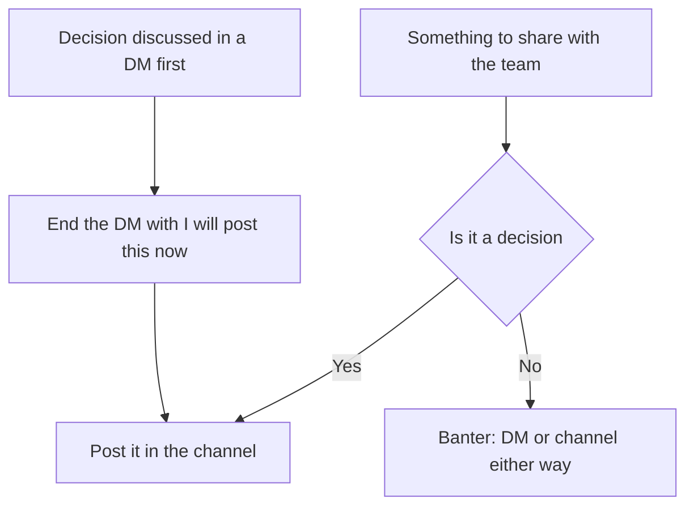
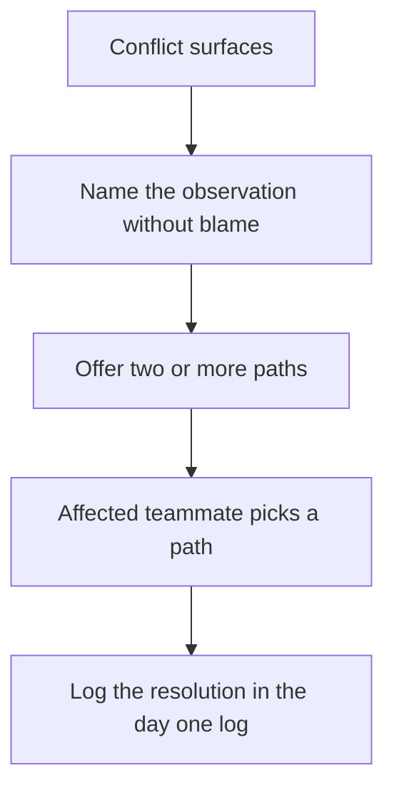

# Lecture 3 — Comms Norms and Fixing Conflict

> **Duration:** ~1.5 hours of reading.
> **Outcome:** You can write the four communication norms (one channel, one doc, one stand-up cadence, one DM rule) for a 24-hour build in 15 minutes. You can run a 10-minute stand-up using the three-question template (what shipped, what is blocking, what is the next 4 hours). You can recognize the four most common day-1 team conflicts — scope creep, silent disagreement, role overlap, the "I'll just rewrite it" merge fight — and deliver a one-sentence intervention for each without escalating the conflict. You can write a `DAY-1-LOG.md` entry for any named event in under 5 minutes.

If you only remember one sentence from this lecture, remember this:

> **Comms norms are the half of a 24-hour build that beginners skip and then spend hour 14 paying for. Four norms set in 15 minutes at the kickoff prevent four named conflicts at hour 14. The fix is mechanical; the discipline is the band.**

Lecture 1 taught you the kickoff. Lecture 2 taught you the scope and the parallel tracks. Lecture 3 teaches you the *grease* — the communication norms that hold the team together while the tracks run in parallel, and the conflict-resolution interventions for when the grease fails. Norms are not soft skills; they are mechanical disciplines that decide whether the team's hour 14 is a productive sprint or a 4-hour Slack argument.

---

## 1. Why comms norms are a separate skill

The first reaction beginners have to "your team needs four written communication norms" is: *we are four people; we can just talk.* We know each other; we will figure it out.

That reaction is wrong on every count. Here is the steel-man:

> **C4 voice:** "we can just talk" works for two people on a 2-hour pair-programming lab. It does not work for four people on a 24-hour build with three parallel tracks and a 4-hour sleep window. Implicit norms produce implicit decisions, and implicit decisions surface at hour 18 as side-channel arguments. Written norms produce explicit decisions, and explicit decisions surface at the next stand-up as named log entries.

### 1.1 What comms norms actually do

Five short sentences, one per outcome:

- **Norms move decisions from DMs to the channel.** A decision in a DM is invisible to the other 2 or 3 teammates; the decision becomes a future conflict when one of them learns about it at stand-up 2 ("you decided what?"). The DM-vs-channel rule prevents this.
- **Norms move status from voice to text.** A status update on a voice call is heard once and forgotten; a status update in #channel is searchable and pinned. The stand-up's note-taker writes the status in #channel as the stand-up happens.
- **Norms move decisions from speed to deliberation.** A decision made in 20 seconds on the team call is fast but often wrong; a decision named in #channel, with a 5-minute reaction window, is slower but right. The norm is *time-boxed deliberation*, not infinite deliberation.
- **Norms move conflict from emotion to process.** A conflict at hour 14 in a tired team becomes an argument; the same conflict at hour 14 with a stand-up template becomes a 5-minute process. The norm is the *channel through which* conflict resolves.
- **Norms produce the audit trail.** The `DAY-1-LOG.md` is a byproduct of the norms — if the norms are followed, the log writes itself. If the norms are not followed, the log is a fiction reconstructed by the Comms Lead at hour 24.

If the norms do not produce any of these five outcomes, the norms are decoration. If they produce all five, the team's 24-hour audit trail is honest and the post-dry-run retrospective is useful.

### 1.2 The four norms

```
┌────────────────────────────────────────────────────────────┐
│  THE FOUR COMMUNICATION NORMS                              │
│                                                            │
│  NORM 1: One channel                                       │
│    The team has ONE chat channel for all team              │
│    communication. Not two. Not Slack-plus-Discord.         │
│                                                            │
│  NORM 2: One shared doc                                    │
│    The team has ONE shared doc / wiki / repo file for      │
│    artifacts: worksheet, log, stand-up notes.              │
│                                                            │
│  NORM 3: One stand-up cadence                              │
│    Stand-ups at hours 4, 12, 22. Ten minutes each.         │
│    Three questions: shipped / blocking / next 4h.          │
│                                                            │
│  NORM 4: One DM rule                                       │
│    Decisions in #channel. Banter in DMs. If you DM         │
│    a decision, re-post it to the channel within 30 min.   │
└────────────────────────────────────────────────────────────┘
```

Four norms. Each is one sentence. Each is enforceable by the Comms Lead with a one-sentence intervention. The norms are pinned in the team channel (pins 1-4 from Lecture 1) so a teammate can re-read them in 30 seconds.

---

## 2. Norm 1 — One channel

The team has *one* chat channel. Not two. Not "Slack for chat and Discord for voice." Not "the build-track channel and the design-track channel." One channel.

### 2.1 Why one and not many

Four short sentences:

- **One channel is one notification surface.** A teammate stepping away from the call can check one channel in 60 seconds and catch up. Two channels = double the catch-up time = teammates skipping one.
- **One channel preserves cross-track visibility.** The Demo Lead needs to see when MUST 1 ships; the Builder Lead needs to see when the demo script's hook is decided. One channel keeps both visible to both.
- **One channel reduces channel-creation overhead.** A team that opens a new channel "for the design track" spends 5 minutes on the channel setup and then forgets to invite the Comms Lead. The channel sprawl is invisible until hour 12 when half the decisions are in the design-track channel.
- **One channel is the simplest rule to enforce.** The Comms Lead's intervention sentence — "Mind dropping that in #team?" — works if there is one #team. It does not work if there is #team-build and #team-design.

### 2.2 The channel-name choice

The channel name does not matter. The team picks a name in the first 60 seconds of segment 5 of the kickoff (Lecture 1 §6) and never re-litigates it.

Three rules:

- **Use the team's placeholder name + a suffix.** "#crunch-7-a-team" or "#team-crunch-7-a." Clear ownership.
- **Avoid the project name in the channel name.** The project's name might change at hour 12; the team's name is stable. The channel name follows the stable identifier.
- **Public to the cohort if the cohort has a shared workspace.** A C4 cohort with a shared Slack should keep team channels public to the cohort by default — peer review is a value, and a public channel is reviewable.

### 2.3 The channel's voice baseline

The channel's voice baseline matches the C4 voice — sober, editorial, no emojis required (emojis are fine but not the substance), no "rockstar / ninja / 10x" language, no apology preface at the top of every message. The Comms Lead sets the tone in the first three messages they post (the hour-0 log entry, the kickoff agenda pin, the schedule pin) and the team's voice tends to mirror the Comms Lead's.

> **C4 voice:** the channel is a working surface, not a performance. Posts are short, named, and timestamped where useful. Messages do not need to be polished; they need to be *readable* by a tired teammate at hour 18.

---

## 3. Norm 2 — One shared doc

The team has *one* shared doc tool. The doc holds the worksheet, the log, the stand-up notes, the script draft, and any other text artifact. Not two docs. Not "Google Docs for the worksheet and Notion for the log."

### 3.1 Why one and not many

Four short sentences:

- **One doc is one bookmark.** Every teammate has one bookmark in their browser: the team doc. They open it 20 times across the 24 hours. One click per open.
- **One doc preserves cross-artifact links.** The log entry for the hour-2 scope pass *links* to the worksheet, which lives in the same doc. The link is a relative anchor, not a URL across tools.
- **One doc is the simplest backup target.** The Comms Lead can commit the doc's contents to the repo at every named event; the commit is one file. Two docs = two commits = a higher chance one is forgotten.
- **One doc reduces tool-switching cost.** A teammate context-switching from the repo to the doc to the channel to the call is already managing 4 surfaces. Adding a fifth (a second doc) is one too many.

### 3.2 The doc structure

The doc has four sections, in this order:

```
1. TEAM-CONTRACT.md   (drafted at hour 0, formalized at hour 1)
2. SCOPING-WORKSHEET.md  (drafted at hour 2, formalized at hour 2:30)
3. DAY-1-LOG.md  (continuous, with timestamped entries)
4. SCRIPT-DRAFT.md  (drafted by hour 12, finalized by hour 23:30)
```

Four sections. The Comms Lead opens the doc at hour 0:50 (last action of segment 5 of the kickoff) and pins it in the channel. By hour 1:30 the four sections have a header and a one-line "to be filled" placeholder. The doc is *real* by hour 2:30 and *complete* by hour 24:30.

### 3.3 The repo-vs-doc choice

The team has two options for "the doc":

- **Option A: Markdown files in the repo.** `TEAM-CONTRACT.md`, `SCOPING-WORKSHEET.md`, `DAY-1-LOG.md`, `SCRIPT-DRAFT.md` are committed files. Every teammate edits via the GitHub web UI or a local clone. Pros: version-controlled by default; commits in the repo's history. Cons: edit latency (commit-push-pull); merge conflicts on the log file at the same minute.
- **Option B: A shared Google Doc or HackMD.** A single shared edit surface. Pros: real-time collaborative editing; no merge conflicts. Cons: not version-controlled by default; the team has to commit a snapshot to the repo at named events.

C4's default recommendation: **Option B for the live shared doc, with snapshots committed to the repo at hours 0, 2, 4, 12, 22, and 24.** The live doc is the working surface; the repo is the audit trail. The Comms Lead snapshots at named events; the snapshot is a `git commit` of the four `.md` files with the doc's current content.

---

## 4. Norm 3 — One stand-up cadence

The team has *one* stand-up cadence: hours 4, 12, and 22. Ten minutes each. Three questions: what shipped, what is blocking, what is the next 4 hours. One designated note-taker (the Comms Lead by default; rotated if Comms Lead is the one being asked the questions).

### 4.1 Why three stand-ups in 24 hours

Four short sentences:

- **Hour 4 surfaces hour-2 scope-pass errors.** If the team agreed on a MUST that nobody can actually start, hour 4 is when that surfaces. Earlier is too soon (the work hasn't started); later is too late (4 hours of wrong work is hard to undo).
- **Hour 12 is the natural midpoint.** Twelve hours into a 24-hour build is the natural retrospective midpoint. The team has shipped roughly half; the team has 12 hours left; the role rotation (4-person teams) happens here.
- **Hour 22 is the demo-readiness gate.** Two hours before the recording, the team checks readiness. The MUSTs are at done-row status or they are not; the deploy URL is stable or it is not; the demo script is ready to record or it is not. Hour 22 is the *last* gate before the recording.
- **More stand-ups produces meeting fatigue.** A stand-up every 4 hours would mean 6 stand-ups in 24 hours; each one cuts 10 minutes from the build window and 5 minutes of context-switch cost. Three stand-ups is the floor; four is decoration; six is destructive.

### 4.2 The three-question template

```
┌────────────────────────────────────────────────────────────┐
│  THE STAND-UP — 3 QUESTIONS, 10 MINUTES                    │
│                                                            │
│  Each teammate answers, in turn:                           │
│                                                            │
│  Q1. What did you ship since the last stand-up?            │
│      (Or, for stand-up 1: what did you ship since the      │
│       scope pass?)                                         │
│                                                            │
│  Q2. What is blocking you right now?                       │
│      (If nothing: "no block.")                             │
│                                                            │
│  Q3. What is the next 4 hours?                             │
│      (Specific. "I will merge MUST 1's PR by hour 8" —     │
│       not "I'll keep working on stuff.")                   │
└────────────────────────────────────────────────────────────┘
```

Three questions. Each teammate's answer is *2 minutes max*. A four-person team's stand-up runs in 8 minutes; the remaining 2 minutes are for any cross-track decision the questions surfaced.

### 4.3 The note-taker's job

The Comms Lead writes the stand-up notes as the stand-up happens. The notes go directly into `DAY-1-LOG.md`. The format:

```markdown
## Hour 4:00 — Stand-up 1 (UTC YYYY-MM-DDTHH:MM)

**Pat (Builder Lead):**
  - Shipped: signup scaffolding, deploy URL is live.
  - Blocking: no block.
  - Next 4h: MUST 1 done by hour 8; start MUST 2 by hour 8:30.

**Sam (Demo Lead):**
  - Shipped: hook draft committed.
  - Blocking: waiting for seeded data to record screen captures.
  - Next 4h: script draft outline; record screen-capture rough by hour 8.

**Jordan (Comms Lead):**
  - Shipped: hour-0 and hour-2 log entries; 5 pinned messages.
  - Blocking: no block.
  - Next 4h: live-monitor channel; log any conflict; stand-up 2 prep at hour 11:45.

**Alex (Floating Builder):**
  - Shipped: MUST 1 user-story note; PR for empty-feed state seeded data.
  - Blocking: waiting on Pat's signup schema for the seed data.
  - Next 4h: unblock at hour 4:30 after signup PR merges; then MUST 2 backend.

**Cross-track:** Sam's recording waits on Alex's seed data; Alex's seed data waits on Pat's signup. Order: Pat (hour 5), Alex (hour 6), Sam (hour 8).
```

The note is the artifact. The Comms Lead commits it to the repo by hour 4:10 — within 10 minutes of the stand-up ending.

### 4.4 The async stand-up fallback

If the team spans time zones and the stand-up's wall-clock time falls during a teammate's sleep window, the team runs an *async stand-up*. Each teammate posts their three-question answer in #channel as a *single message* with a `#standup` tag, before the stand-up wall-clock time. The note-taker compiles the answers into the log entry.

Two rules for async stand-ups:

- **The async post must be at the wall-clock time, not 4 hours late.** A teammate posting at hour 4:00 their morning (wall-clock hour 4) makes the async stand-up work; posting at hour 8 makes the team wait 4 hours.
- **The async post is read aloud by the note-taker at the stand-up.** The async post is *not* a substitute for the stand-up; it is the absent teammate's contribution. The remaining teammates run the synchronous version with three voices instead of four.

---

## 5. Norm 4 — One DM rule

The team has one rule for DMs: *decisions in #channel, banter in DMs, and if you DM a decision, re-post it to the channel within 30 minutes.*

### 5.1 What counts as a decision

A decision is any of:

- A scope cut. "We are cutting MUST 3 to a SHOULD."
- A role-rotation. "Alex is taking over as Builder Lead at hour 12."
- A schedule change. "Stand-up 2 is moved to hour 13."
- An external dependency change. "We are dropping the WebSocket library and using setInterval."
- A team-name change. "We are renaming the team from Crunch-7-A to Quickhelp."

Each of these is a decision. Each goes in #channel. If two teammates discussed the decision in DMs first, the DM ends with: "I'll post this in #channel now." The post in #channel is the decision; the DM was the deliberation.


*The DM rule funnels every decision into the shared channel, no matter where it started.*

### 5.2 What counts as banter

Banter is any of:

- Encouragement. "Nice work on the signup PR."
- Time-zone friendly check-ins. "I'm logging off for 2 hours; you good?"
- Tool tips. "Did you know GitHub Projects has a default kanban template?"
- Off-topic chat. "What time is your local time zone again?"

Banter is fine; banter is the team's social fabric. Banter goes in DMs or in the channel — both are acceptable. The rule is about *decisions*, not about non-decision messages.

### 5.3 The "re-post to channel" enforcement

The Comms Lead's standing rule is to ask, when they see a decision-looking message in any visible DM or in the channel: "Was that a decision? Mind dropping it in #channel?" The question is *not* an accusation; it is a *prompt* to re-post.

Three examples:

- **Builder Lead DMs Demo Lead:** "Yeah let's cut MUST 3 to SHOULD." → Comms Lead sees this via a forwarded screenshot or via the post in #channel that *should have* happened. Intervention: "Was the MUST-3 cut decided? Mind dropping a one-line decision post in #channel?" Builder Lead posts.
- **Two teammates in a side voice call:** they decide to drop the WebSocket library. Comms Lead is not on the side call. They learn about it 30 minutes later when a teammate references it in #channel. Intervention: "Did we drop the WebSocket library? When? Can someone post the decision and the time?" The decision is *backfilled* in the log; the next time, the side-call ends with one of the teammates posting in #channel.
- **Builder Lead posts in #channel:** "Cutting MUST 3 to SHOULD because WebSocket complexity is too high. Confirming with team — react with 👍 or 👎 in 5 minutes." Three teammates react 👍; one reacts 👎 with a comment. The team discusses for 3 minutes; consensus reached; decision pinned. *Correct flow.*

The third example is the goal. The first two are surfaceable failures; the Comms Lead's intervention is the surface.

---

## 6. The hour-by-hour stand-up integration

The three stand-ups thread the hour-by-hour schedule (Lecture 2 §5). Each stand-up has a specific *gate* function in the schedule.

### 6.1 Stand-up 1 (hour 4) — the scope-pass gate

Stand-up 1's specific function is to *verify* the scope pass from hour 2 is workable. Three checks:

- **Done-row check:** does each MUST's done-row still match the work the owner is doing? If not, the owner re-states the done-row and the team confirms.
- **Hour-estimate check:** is each MUST's estimate still credible? If MUST 3 was estimated at 8 hours and the owner now estimates 14, the team re-scopes at the stand-up (cut to SHOULD or split MUST 3 into MUST 3a and MUST 3b).
- **Deploy URL check:** is the deploy URL live? If not, the build track is non-functional and the team's hour 4-8 plan is to fix the deploy.

Stand-up 1's exit criterion: every MUST has a confirmed owner, a confirmed done-row, a credible hour estimate, and a live deploy URL.

### 6.2 Stand-up 2 (hour 12) — the midpoint gate

Stand-up 2's specific function is the *midpoint retrospective*. The team has 12 hours done; 12 hours left. The questions are still the three, but the answers are *interpreted* against the original plan:

- **Is the team ahead or behind?** "MUST 1 is shipped; MUST 2 is in PR; MUST 3 is scaffolded." vs original "MUST 1 by hour 8; MUST 2 by hour 14; MUST 3 by hour 22." If ahead, the team can pull in a SHOULD. If behind, the team cuts a MUST to SHOULD now, not at hour 22.
- **Are the roles still right?** The 4-person team rotates Builder Lead at hour 12 (Lecture 1 §4.3). The rotation is announced at stand-up 2 and logged.
- **Is anyone burning out?** The team-health one-word check (anticipating the close-out). Each teammate says one word about how they feel. The Comms Lead logs the words. A team with three "tired" and one "energized" is a team that needs a longer hour 14-18 sleep window.

Stand-up 2's exit criterion: the team's next-12-hour plan is named; the role rotation is logged (if applicable); the team-health words are captured.

### 6.3 Stand-up 3 (hour 22) — the demo-readiness gate

Stand-up 3's specific function is the *demo-readiness gate*. The recording is at hour 23:30-24:00; the rehearsal is at hour 22:10-23:30. The stand-up confirms readiness:

- **MUSTs are done.** Each MUST's done-row is satisfied on the deploy URL, verified live during the stand-up by the Builder Lead opening the URL on a phone.
- **The deploy is frozen.** No more feature merges. The Builder Lead announces the freeze; the freeze is logged.
- **The script is final.** The Demo Lead reads the script aloud to the team. The team agrees on the three demo clicks and the hook. If the script is not final, the rehearsal time at hour 22:10 absorbs the script finalization.
- **The recording tool is ready.** Loom is logged in; the browser is on the deploy URL; the timer is set; the audio is checked.

Stand-up 3's exit criterion: the team is *recording-ready* at hour 22:10 — script, deploy, tool, audio, all confirmed.

---

## 7. The four day-1 conflicts and the one-sentence interventions

Four predictable conflicts during the first 24 hours of team mode. Each has a *symptom*, a *root cause*, and a *one-sentence intervention* delivered by the Comms Lead (or any teammate, but the Comms Lead enforces it by default).

### 7.1 Conflict 1 — Scope creep

> **Symptom:** the build track absorbs a SHOULD or COULD item without the team's hour-2 worksheet being updated.

A teammate is finishing MUST 2 and has 45 minutes free. They start "just polishing the post card" — a SHOULD. The polish takes 2 hours; MUST 3 starts late. At stand-up 2 the team is behind schedule and nobody knows why.

**Root cause:** the SHOULD was never explicitly approved as the team's next priority; the teammate made a unilateral decision to absorb it. The decision was invisible because it was made in the IDE, not in #channel.

**One-sentence intervention (Comms Lead, in #channel):**

> "Is the post-card polish a SHOULD pull-in? If so, can we name it as a scope change and update the worksheet? If not, can we park it for the hour-22 buffer?"

The intervention does three things in one sentence: it surfaces the decision, it offers two paths (formal pull-in or park), and it does not blame the teammate. The teammate's response is usually "good catch, parking it" — and the SHOULD goes back in the SHOULD column.

### 7.2 Conflict 2 — Silent disagreement

> **Symptom:** at stand-up 1 or stand-up 2, a teammate gives clipped one-word answers ("yeah, fine, no block") and stops engaging in the channel.

The teammate is unhappy with something — the scope, the role, a teammate's behavior — but is not surfacing it. The team interprets the silence as "no problem" and continues. At hour 18 the teammate posts a frustrated message; the team is blindsided.

**Root cause:** the team has no explicit invitation to surface disagreement. The stand-up's three questions do not ask "is anything bothering you?"; the answer is filtered through the three questions and the disagreement is filtered out.

**One-sentence intervention (Comms Lead, in DM to the silent teammate):**

> "Hey — I noticed your stand-up answers were short. Anything you would change about how the team is running? Channel or DM is fine."

The intervention does three things: it names the observation (the short answers), it offers a low-pressure surface (anything you would change), and it gives an out (channel or DM). The teammate often responds with a specific issue — "Pat is making merge decisions without checking with me" — which is then surface-able at the next stand-up as a process correction.

### 7.3 Conflict 3 — Role overlap

> **Symptom:** two teammates are both making decisions on the same artifact, with conflicting outcomes.

The Builder Lead has merged a PR for MUST 2; the Floating Builder, working in parallel, has a different PR for MUST 2 with a different approach. The two approaches conflict; the team has a fork. The argument starts in #channel and escalates.

**Root cause:** the role-assignment grid was filled in at the kickoff but never *enforced*. The Floating Builder thought they had decision authority on MUST 2 because the Builder Lead was busy with MUST 1.

**One-sentence intervention (Builder Lead, in #channel):**

> "I'm going to merge [PR A]. [PR B] is good work; can we either turn it into a follow-up PR or close it? Either is fine — Floating Builder, your call."

The intervention does three things: it names the decision (merge PR A), it acknowledges the other work ("good work"), and it gives the Floating Builder a choice (follow-up or close). The Builder Lead is the *decider* on merges; saying so is not a status grab, it is the role's job. The Floating Builder picks an option; the conflict resolves; the log captures it.

### 7.4 Conflict 4 — The "I'll just rewrite it" merge fight

> **Symptom:** a teammate's PR has been open for 4 hours waiting on review; in the meantime, another teammate has rewritten the same feature in their own branch.

The Builder Lead is busy with MUST 3; Sam's MUST 2 PR is waiting on review. Alex, frustrated by the delay, starts re-writing MUST 2 from scratch in a new branch. The two implementations are now in conflict; one will be wasted work.

**Root cause:** the PR review SLA was not defined. The team has no agreement on how long a PR can sit before the author has the right to escalate.

**One-sentence intervention (Comms Lead, in #channel as a *new norm proposal*):**

> "Proposing: PRs get a 60-minute review SLA. After 60 min, the PR author can escalate in #channel and the Builder Lead reviews within 10. Any objections?"

The intervention is *not* about Alex's rewrite (the personal fight); it is about *setting the missing norm* (the structural fix). The norm proposal is named, time-boxed, and reviewable. The Builder Lead either confirms or counter-proposes; the team agrees within 5 minutes; the norm is pinned. The original conflict resolves because the *structure* changed, not because anyone apologized.

### 7.5 The pattern across all four conflicts

The pattern is the same:

```
┌────────────────────────────────────────────────────────────┐
│  THE CONFLICT INTERVENTION PATTERN                         │
│                                                            │
│  1. Surface the issue without blame.                       │
│     (Name the observation; do not name the person's fault.)│
│                                                            │
│  2. Offer two or more paths.                               │
│     (Pull-in or park; channel or DM; follow-up or close.)  │
│                                                            │
│  3. Give the affected teammate the choice.                 │
│     (They pick; the team supports.)                        │
│                                                            │
│  4. Log the resolution.                                    │
│     (One paragraph in DAY-1-LOG.md, timestamped.)          │
└────────────────────────────────────────────────────────────┘
```

Four steps. The intervention is *not* about being polite; it is about being *structural*. A polite intervention without a structural change leaves the conflict for hour 18. A structural intervention without politeness can land but tends to bruise. Both are required.


*The four-step pattern the Comms Lead applies to any of the four day-1 conflicts.*

---

## 8. The hour-24 close-out

The close-out is a 30-minute meeting at hour 24:00-24:30. It is the dry-run's *exit* and the bridge into Week 8 (day 2).

### 8.1 The close-out's three named outputs

```
┌────────────────────────────────────────────────────────────┐
│  THE CLOSE-OUT — 3 NAMED OUTPUTS                           │
│                                                            │
│  OUTPUT 1: What shipped vs MUST                            │
│   For each MUST: did the done-row pass on the deploy URL? │
│   Y/N + one sentence of context.                          │
│                                                            │
│  OUTPUT 2: The day-2 plan                                  │
│   The first 3 items the team would tackle in the next 24 │
│   hours if this were a 48-hour event. Three bullets.      │
│                                                            │
│  OUTPUT 3: The team-health one-word check                  │
│   Each teammate: one word. Logged. Not "fine."             │
└────────────────────────────────────────────────────────────┘
```

Three outputs. Thirty minutes. The Comms Lead writes each output in `DAY-1-LOG.md` as the meeting happens.

### 8.2 The close-out agenda

```
[ 0:00 — 0:05 ] Quick state read (deploy URL up; demo recorded)
[ 0:05 — 0:15 ] Output 1: MUST-by-MUST done-row check
[ 0:15 — 0:25 ] Output 2: day-2 plan (3 bullets)
[ 0:25 — 0:30 ] Output 3: team-health words + final log entry
```

Thirty minutes. Five segments. The team's *exit voice* matches the entry voice — sober, named, structured.

### 8.3 The team-health word

The team-health one-word check is the *honest* part of the close-out. Each teammate says one word describing how they feel after 24 hours. Examples:

- "Tired-but-good."
- "Frustrated."
- "Energized."
- "Behind."
- "Hungry."
- "Proud."
- "Worried."

The word is *not* graded. The team does not respond with reassurance; the team *logs* the words. The log is the audit trail for the post-dry-run retrospective in Week 8.

Three words to *not* say (because they hide more than they reveal):

- "Fine." Decoration. Useless data.
- "Good." Decoration. Useless data.
- "Whatever." Defensive. Surface the real word.

The Comms Lead's one-sentence prompt: "Not 'fine' or 'good' — one word that actually describes the feeling." The team can sit in silence for 10 seconds while teammates find the right word; the silence is fine.

### 8.4 The close-out's final log entry

```markdown
## Hour 24:30 — Close-out (UTC YYYY-MM-DDTHH:MM)

**MUSTs shipped:**
  - MUST 1 (signup + post): YES. Done-row satisfied on deploy URL.
  - MUST 2 (peer reply): YES. Done-row satisfied on deploy URL.
  - MUST 3 (real-time push): PARTIAL. Polling-every-2s fallback works; WebSocket version cut to SHOULD at stand-up 2.

**Day-2 plan (first 3 items):**
  1. Replace polling with WebSocket version (cut SHOULD).
  2. Add the empty-feed state (SHOULD).
  3. Record a second demo take after WebSocket lands.

**Team-health words:**
  - Pat: "tired-but-proud."
  - Sam: "energized."
  - Jordan: "behind-on-log-catchup."
  - Alex: "ready-for-sleep."

**Recording link:** [YouTube unlisted URL]
**Repo link:** [GitHub repo URL]
**Dry-run complete.**
```

The close-out is *over*. The team leaves the call. The dry-run's log is committed.

---

## 9. Comms norms are half the artifact

The other half is the *enactment* — the actual messages sent, the actual decisions made, the actual conflicts surfaced and resolved. The norms are written in the kickoff; the enactment happens across 23 hours; the audit trail is the log.

Most teams *write* the norms in 15 minutes and then *forget* them by hour 8. The Comms Lead's job is the *enforcement* — one intervention sentence per norm, repeated as needed. The norms hold to the extent the Comms Lead enforces them.

The norms are not the team's *culture*. The team's culture is built across many events. The norms are the team's *day-1 operating procedure* — the minimum coordination layer that a 24-hour build needs to function. Culture is downstream; norms are upstream.

---

## 10. Recap

- The four communication norms — one channel, one shared doc, one stand-up cadence, one DM rule — are set in 15 minutes at the kickoff and enforced across 23 hours by the Comms Lead.
- Norm 1 (one channel) is one notification surface for the whole team. Norm 2 (one shared doc) holds the worksheet, log, stand-up notes, and script. Norm 3 (stand-up cadence) is hours 4, 12, 22 with the three-question template. Norm 4 (DM rule) is *decisions in channel, banter in DMs, re-post if you DMed a decision*.
- The three-question stand-up template (shipped, blocking, next 4h) is 2 minutes per teammate, 10 minutes total. The Comms Lead writes the note live; the note goes in `DAY-1-LOG.md` within 10 minutes of the stand-up ending.
- Each stand-up has a specific gate function: stand-up 1 verifies the scope pass; stand-up 2 is the midpoint retrospective and the role rotation point; stand-up 3 is the demo-readiness gate.
- The four day-1 conflicts — scope creep, silent disagreement, role overlap, "I'll just rewrite it" merge fight — each have a one-sentence intervention. The pattern is *surface without blame, offer two paths, give the affected teammate the choice, log the resolution*.
- The hour-24 close-out is a 30-minute meeting with three named outputs (MUSTs vs done-row, day-2 plan, team-health words). The team-health word is one word, not "fine."
- The norms are upstream; the team's culture is downstream. The Comms Lead's enforcement is the day-1 link between the two.

This is the last lecture of Week 7. The team now has the kickoff (Lecture 1), the scope and parallelization (Lecture 2), and the comms and conflict-resolution norms (Lecture 3). The next artifact is the actual dry-run — the mini-project — where the team enacts all three lectures in 24 wall-clock hours with at least one other human in the room or on the call.

Continue to the [exercises](../exercises/) — three drills that rehearse the lectures in writing before the dry-run weekend. Exercise 1 is the team-charter for a fake event; Exercise 2 is the hour-by-hour schedule for a fake prompt; Exercise 3 is the four-conflict intervention drill.
